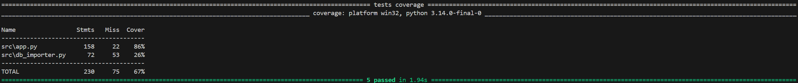

# 📘 Technisches IT-Konzept

**Projekt:** Projekt-Analyse-Cockpit
**Version:** 1.0
**Status:** Produktiv

---

## 1. Einleitung & Zielsetzung

Das "Projekt-Analyse-Cockpit" ist eine lokale Stand-Alone-Applikation zur automatisierten Auswertung von SAP-Finanzdaten. Ziel ist es, die Diskrepanz zwischen manueller Excel-Verarbeitung und fehlender Transparenz über Rest-Budgets zu schließen. Das System konsolidiert Ist-Kosten, Obligo und Budget-Daten in einer relationalen Struktur und visualisiert diese interaktiv.

---

## 2. Systemarchitektur

Die Anwendung folgt einer **3-Schicht-Architektur**, die aktuell lokal auf dem Client des Anwenders ausgeführt wird (Fat-Client-Ansatz via Browser-Interface).

### 2.1 Komponenten

1. **Datenhaltung (Persistence Layer):**

   * **Technologie:** SQLite (`finanzdaten.db`)
   * **Grund:** Serverlose, dateibasierte Datenbank, die keine Admin-Rechte zur Installation benötigt und ideal für Single-User-Szenarien ist.
2. **Logik & ETL (Business Logic Layer):**

   * **Technologie:** Python 3.10 + Pandas
   * **Aufgabe:** Importskripte (`db_importer.py`) bereinigen Rohdaten (SAP-Formate), führen Typ-Konvertierungen durch und verknüpfen Datensätze logisch (Mapping).
3. **Präsentation (Frontend Layer):**

   * **Technologie:** Streamlit + Plotly
   * **Aufgabe:** Rendern eines reaktiven Web-Dashboards im Standard-Browser (`localhost`).

---

## 3. Datenfluss & ETL-Prozess

Der Kern des Systems ist der ETL-Prozess (Extract, Transform, Load), der durch `db_importer.py` gesteuert wird.

### Schritt 1: Extraktion (Extract)

* Das System scannt den Ordner `/data` nach `.xlsx`-Dateien.
* **Erkennungslogik:** Dateinamen werden auf Keywords geprüft:
  * `CJI3` → Ist-Kosten
  * `CJI5` / `CNB` → Obligo
  * `LV` / `Journal` → Budget/Verträge

### Schritt 2: Transformation (Transform)

* **Normalisierung:** Deutsche Zahlenformate (`1.000,00`) werden in internationale Floats (`1000.00`) konvertiert.
* **Spalten-Mapping:** SAP-technische Spaltennamen (z.B. "Objekt", "Wert/BWähr") werden intern standardisiert.
* **Aggregation:** Daten werden bei Bedarf auf PSP-Ebene voraggregiert.

### Schritt 3: Laden (Load)

* Die bereinigten Dataframes werden via SQLAlchemy (`to_sql`) in die SQLite-Datenbank geschrieben.
* Modus: `replace` (Tabellen werden bei jedem Import komplett neu aufgebaut, um Datenkonsistenz mit dem SAP-Export zu gewährleisten).

---

## 4. Datenmodell & Logik

Das Datenmodell ist kein klassisches Sternschema, sondern ein **transaktionsorientiertes Modell**, das auf der Laufzeit-Verknüpfung basiert.

*(Siehe Datei `documentation/DATENMODELL.md` für das grafische ER-Diagramm)*

### Wichtige Design-Entscheidungen:

* **Full Outer Join:** Die Berechnung des "Gesamtauftragswerts" erfolgt durch einen Full Outer Join über die `Bestellnummer`.
  * *Warum?* Es gibt Bestellungen, die nur im Obligo existieren (noch keine Rechnung) und solche, die nur im Ist existieren (Obligo abgebaut). Ein Inner Join würde Daten verschlucken.
* **PSP-Hierarchie:** Das System erkennt die Struktur `G.0118...` automatisch und gruppiert Kosten auf Projekt- und Teilprojektebene.

---

## 5. Technologie-Stack

| Komponente        | Technologie | Version | Verwendung                                 |
| :---------------- | :---------- | :------ | :----------------------------------------- |
| **Sprache** | Python      | 3.10+   | Hauptlogik                                 |
| **GUI**     | Streamlit   | 1.x     | Web-Interface                              |
| **Daten**   | Pandas      | 2.x     | ETL, Berechnung, Merges                    |
| **Charts**  | Plotly      | 5.x     | Interaktive Visualisierung (Ampeln, Donut) |
| **DB**      | SQLite      | 3       | Lokaler Speicher                           |
| **ORM**     | SQLAlchemy  | 2.x     | DB-Verbindung                              |
| **Excel**   | OpenPyXL    | 3.x     | Engine zum Lesen von .xlsx                 |

---

## 6. Sicherheitskonzept

Da Finanzdaten sensibel sind, gelten folgende Sicherheitsprinzipien:

1. **Local Execution only:** Keine Daten verlassen den Rechner. Es gibt keine Cloud-Anbindung.
2. **Git-Ignore:** Der Ordner `/data` und die Datenbank `finanzdaten.db` sind via `.gitignore` von der Versionierung ausgeschlossen.
3. **Read-Only Source:** Die SAP-Quelldateien werden nur gelesen, niemals verändert.

---

## 7. Erweiterungsmöglichkeiten (Backlog & Roadmap)

Folgende Features sind bereits im Backlog definiert und für kommende Versionen eingeplant:

### 7.1 PDF-Export (Reporting)

* **Ziel:** Generierung von monatlichen Statusberichten direkt aus Streamlit.
* **Geplante Umsetzung:** Integration einer Reporting-Engine (z.B. `WeasyPrint` oder `ReportLab`), die die aktuellen KPIs und Diagramme in ein standardisiertes PDF-Layout rendert und als Download anbietet.

### 7.2 Web-Anbindung (Server-Deployment)

* **Ziel:** Ablösung der lokalen `.bat`-Ausführung durch ein zentrales Hosting.
* **Geplante Umsetzung:** Containerisierung der Anwendung (Docker) und Bereitstellung im Firmen-Intranet.
* **Vorteil:** Nutzer müssen keine Python-Umgebung mehr lokal installieren.

### 7.3 Nutzerverwaltung (User Management)

* **Ziel:** Schutz der Daten vor unbefugtem Zugriff bei zentraler Bereitstellung.
* **Geplante Umsetzung:** Implementierung eines Login-Screens und Rollenkonzepts (z.B. *Controller* darf editieren/importieren, *Projektleiter* darf nur lesen).

### 7.4 REST-API Schnittstelle

* **Ziel:** Bereitstellung der aufbereiteten Daten für Drittsysteme.
* **Geplante Umsetzung:** Entwicklung von API-Endpunkten (z.B. via FastAPI), um die bereinigten Finanzdaten (JSON) an BI-Tools oder andere Dashboards zu übergeben.

---

## 8. Qualitätssicherung & Betrieb

Um die Zuverlässigkeit der Finanzberechnungen und die Stabilität der Anwendung zu gewährleisten, setzen wir auf einen ganzheitlichen QA-Ansatz, der automatisierte Tests (Pre-Deployment) mit aktivem Monitoring (Post-Deployment) verbindet.

### 8.1 Test-Strategie (Automatisierung)

Wir setzen auf das Framework **`pytest`**, um verschiedene Ebenen der Anwendung zu prüfen:

1. **Unit-Tests (Logik):**
   * Validierung der `clean_currency_string` Funktion: Stellt sicher, dass SAP-Formate (`1.000,00`) korrekt in rechenbare Floats konvertiert werden.
   * Überprüfung der Budget-Formel (`Verfügbar = Budget - (Ist + Obligo)`).
2. **Integration-Tests (Daten):**
   * Test des "Full Outer Join"-Algorithmus, um sicherzustellen, dass keine Bestellungen verloren gehen, die nur im Obligo oder nur im Ist existieren.
3. **System-Tests (UI):**
   * Ein "Smoke-Test" startet die Streamlit-Applikation bei jedem Durchlauf headless, um sicherzustellen, dass der Python-Code ohne Syntaxfehler lädt.

### 8.2 Reproduzierbarkeit & Coverage

Die Tests sind so konzipiert, dass sie auf jeder lokalen Umgebung ausgeführt werden können.
Befehl: `.\.venv\Scripts\python.exe -m pytest --cov=src`

Mit dem Tool `pytest-cov` messen wir die Testabdeckung:

*(Abbildung: Aktueller Testbericht. Die hohe Abdeckung in `app.py` bestätigt die Stabilität des Dashboards.)*

### 8.3 Monitoring & Error Tracking (Sentry)

Anstelle eines komplexen Server-Monitorings nutzen wir **Sentry** für das Error-Tracking im laufenden Betrieb.

* **Frontend:** Überwacht Abstürze in der Streamlit-Oberfläche.
* **Backend:** Überwacht den ETL-Prozess (`db_importer.py`).

**Vorteil:** Sollte eine Excel-Datei fehlerhaft sein oder der Import scheitern, erhalten wir sofort einen detaillierten Stack-Trace, ohne Log-Dateien auf dem Client suchen zu müssen.

### 8.4 Daten-Validierung (Plausibilitäts-Ergebnis)

Ein wesentlicher Teil der Qualitätssicherung ist der Abgleich der importierten Daten mit der Erwartungshaltung ("Plausi-Check").
