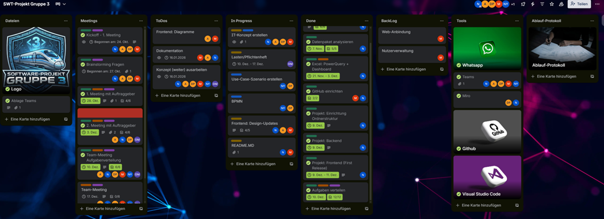
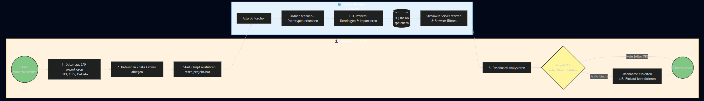
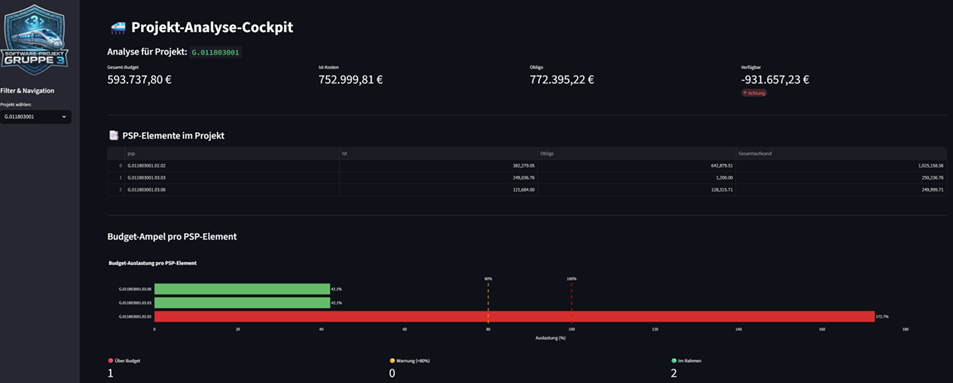

# 📂 Projektdokumentation & Ablauf

**Projekt:** Projekt-Analyse-Cockpit (Gruppe 3)
**Studiengang:** Wirtschaftsinformatik (B.Sc.)
**Modul:** Softwaretechnik-Projekt (5. Sem.)

---

## 1. Verwendete Werkzeuge & Kollaboration

Für die Organisation, Kommunikation und Entwicklung haben wir auf einen bewährten Mix aus modernen Tools gesetzt.

### 1.1 Tool-Stack

| Kategorie               | Tool                         | Verwendungszweck                                           |
| :---------------------- | :--------------------------- | :--------------------------------------------------------- |
| **Kommunikation** | **Microsoft Teams**    | Meetings, Dateiablage, Bildschirmübertragung              |
| **Kommunikation** | **WhatsApp**           | Schnelle Absprachen, Terminfindung ("Kurzer Dienstweg")    |
| **Organisation**  | **Trello**             | Aufgabenverwaltung, Backlog-Priorisierung, Status-Tracking |
| **Konzeption**    | **Miro**               | Brainstorming, Visualisierung der Architektur              |
| **Entwicklung**   | **VS Code**            | IDE für Python-Entwicklung, Debugging, Extensions         |
| **Versionierung** | **GitHub**             | Source Code Management, Collaboration                      |
| **Datenanalyse**  | **Excel / PowerQuery** | Vorabanalyse der Rohdaten, Prototyping der Logik           |

### 1.2 Projektmanagement (Einblick)

Die Aufgabenverteilung erfolgte agil über ein **Trello-Board** mit den Spalten *Dateien*, *Meetings*, *ToDos*, *In Progress*, *Done*, *BackLog*, *Tools* und *Ablaufprotokoll*.

*(Abbildung: Unser Trello-Board während der Entwicklungsphase)*

---

## 2. Lastenheft & Pflichtenheft

Hier definieren wir die Anforderungen aus Kundensicht (Lastenheft) und unsere technische Antwort darauf (Pflichtenheft).

### 2.1 Lastenheft (Anforderungen des Auftraggebers)

**Ausgangslage:**
Die Überwachung von Projektbudgets erfolgt aktuell manuell durch Zusammenkopieren verschiedener SAP-Exporte (CJI3, CJI5) in Excel. Dies ist fehleranfällig, zeitaufwendig und intransparent.

**Ziele:**

1. **Automatisierung:** Einlesen der Rohdaten per Knopfdruck.
2. **Transparenz:** Sofortige Übersicht über verfügbare Rest-Budgets pro PSP-Element.
3. **Plausibilisierung:** Abgleich zwischen geplanten Verträgen und tatsächlichen Buchungen ("Plausi-Check").

**Muss-Kriterien:**

* Lokale Ausführbarkeit (keine Cloud-Instanz).
* Verarbeitung von SAP-Exportformaten (.xlsx/.csv).
* Visualisierung kritischer Budgets (Ampel-System).
* Auflistung offener Bestellungen (Obligo).

### 2.2 Pflichtenheft (Technische Umsetzung)

**Systemumgebung:**

* Entwicklung einer Python-Desktop-Anwendung.
* Nutzung einer lokalen SQLite-Datenbank zur Datenhaltung.

**Funktionale Anforderungen:**

* **Importer:** ETL-Skript, das deutsche Zahlenformate bereinigt und Tabellen verknüpft.
* **Dashboard:** Web-GUI (Streamlit) mit Filtermöglichkeit nach Projektnummer.
* **Charts:** Plotly-Balkendiagramme für Budget-Auslastung und Zeitverlauf.
* **Matrix:** Pivot-Tabelle zur Darstellung von Ist-Kosten vs. Obligo pro Bestellung.

**Nicht-funktionale Anforderungen:**

* Datenschutz: Daten verbleiben im lokalen Ordner `/data`.
* Stabilität: Integration von Sentry für Error-Tracking.
* Wartbarkeit: Modularer Aufbau (Trennung von `app.py` und `db_importer.py`).

---

## 3. Use-Case Szenario

**Titel:** Monatliche Kostenkontrolle durch den Controller
**Akteur:** Klaus (Projekt-Controller)

**Ablauf:**

1. **Export:** Klaus exportiert am Monatsanfang die aktuellen Listen (`CJI3`, `CJI5`, `LV-Liste`) aus SAP.
2. **Ablage:** Er speichert diese Dateien in den Ordner `data/` des Tools und ersetzt die alten Dateien.
3. **Start:** Er führt die Datei `start_projekt.bat` aus.
4. **System-Aktion:**
   * Der Importer läuft im Hintergrund, bereinigt Daten und aktualisiert die Datenbank.
   * Der Browser öffnet sich automatisch mit dem Dashboard.
5. **Analyse:**
   * Klaus wählt sein Projekt `G.0118...` aus.
   * Er sieht sofort eine **rote Ampel** bei PSP-Element `.03.03`.
   * Er klickt auf die **Bestell-Matrix** und sieht, dass eine alte Bestellung noch 80.000 € Obligo blockiert, obwohl das Projekt fertig ist.
6. **Ergebnis:** Klaus kontaktiert den Einkauf, um die Bestellung zu schließen und das Budget freizugeben.

---

## 4. Ablaufprotokoll (Projektphasen)

Der Projektverlauf gliederte sich in 5 Phasen, von der Initialisierung bis zur finalen Abgabe.

### Phase 1: Initialisierung & Setup

* ✅ WhatsApp-Gruppe erstellt & Teams-Kanal angelegt
* ✅ Kickoff-Meeting (Team-Findung & Rollen)
* ✅ Trello-Board aufgesetzt (Kanban-Struktur)

### Phase 2: Analyse & Konzeption

* ✅ Erste Sichtung der Rohdaten (SAP-Exporte)
* ✅ IT-Konzept Gliederung erstellt
* ✅ Brainstorming: Fragenkatalog für Auftraggeber
* ✅ **1. Meeting mit Auftraggeber** (Anforderungsanalyse)
* ✅ Detaillierte Datenpaket-Analyse
* ✅ Miro-Board erstellt (Datenmodell-Skizze)
* ✅ Excel-Prototyping (Power-Query) zum Verständnis der Logik
* ✅ Excel-Dashboard Entwurf (s. Anhang)

### Phase 3: Realisierung (Development)

* ✅ **2. Meeting mit Auftraggeber** (Vorstellung "Plausi-Check" Konzept)
* ✅ GitHub Repository & Visual Studio Code Umgebung eingerichtet
* ✅ Projektstruktur definiert (MVC-ähnlicher Ansatz)
* ✅ Backend: DB-Importer (SQLite) entwickelt
* ✅ Frontend: Streamlit-App analog zum "Plausi-Check" aufgebaut
* ✅ Teammeeting: Feinjustierung Aufgabenverteilung
* ✅ Frontend: Design-Polishing, Logo und Filterfunktionen
* ✅ Frontend: Implementierung der interaktiven Diagramme (Plotly)

### Phase 4: Validierung & Refinement

* ✅ Erstellung Pflichten- und Lastenheft - *Original als PDF-Datei*
* ✅ Ausarbeitung Use-Case Szenario (s. Anhang)
* ✅ Einfache Darstellung als BPMN-Diagramm mit Mermaid (s. Anhang) - *Original mit Bizagi Modeler*
* ✅ Finalisierung ER-Diagramm mit Mermaid (s. Anhang)
* ✅ Frontend:Updates
* ✅ Backend: Testing & Bugfixes (Zahlenformate, Null-Values)
* ✅ **3. Meeting mit Auftraggeber** (Präsentation Status Quo)
* ✅ Interne Rücksprache & Einbau von Feedback
* ✅ Monitoring: Integration von Sentry (Error Tracking)

### Phase 5: Abschluss & Dokumentation

* ✅ Präsenztermin (ausgefallen)
* ✅ Dokumentationen aktualisiert (README, KONZEPT, PROJEKTABLAUF aus Trello)
* ✅ Vorbereitung der Abgabe (Code-Cleanup, Requirements.txt)
* ✅ **Finale Abgabe**

---

## 5. Anhang: Screenshots

**Screenshot: Excel-Dashboard** 

*(Abbildung: Excel-Dashboard mit Powerquery für die ersten Analysen)*

**Screenshot: Trello**

*(Abbildung: Unser Trello-Board während der Entwicklungsphase)*

**Screenshot: Use-Case**

*(Abbildung: Enwturf als Use-Case Szenario)*

**Screenshot: ER-Modell**

*(Abbildung: Über Mermaid erstelltes ER-Datenmodell)*

**Screenshot: BPMN**

*(Abbildung: Vereinfachtes BPMN-Diagramm)*

**Screenshot: Projekt-Analyse-Cockpit**

*(Abbildung: Ausführung im Browser)*
